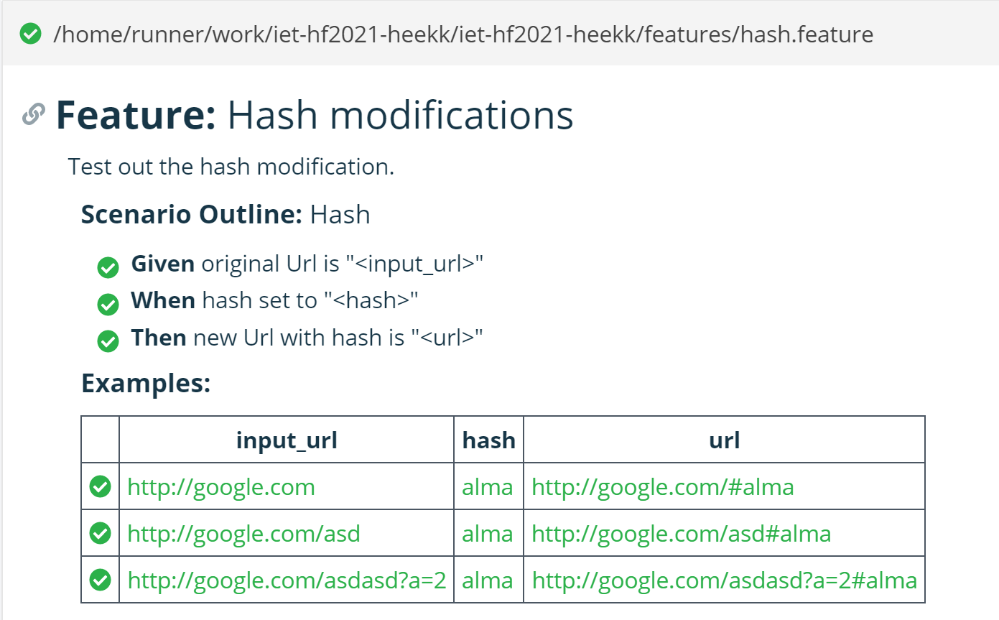

# BDD Teszt
A csapattagok megismertek a BDD alapelveivel, lépéseivel, illetve a kiválasztott framework, a Cucumber.js használatával.
## Tesztek
### Hash teszt
Különböző elérési útvonalú URL-ek esetén is hibától mentesen elvégzi az URL hashének beállítását. Próbáltuk különböző query paraméterek esetén is a robosztusságot.

### Host teszt
Különböző elérési útvonalú URL-ek esetén is hibától mentesen elvégzi az URL hostjának beállítását. Próbáltuk különböző query paraméterek esetén is a robosztusságot. Hostok változtatása esetén is megmarad a többi paraméter.

### Path teszt
Különböző elérési útvonalú URL-ek esetén is hibától mentesen elvégzi az URL pathjának beállítását. Próbáltuk különböző query paraméterek esetén is a robosztusságot.

### Port teszt
Különböző elérési útvonalú URL-ek esetén is hibától mentesen elvégzi az URL portjának beállítását. Próbáltuk különböző query paraméterek esetén is a robosztusságot.

### Protocol teszt
Különböző elérési útvonalú URL-ek esetén is hibától mentesen elvégzi az URL protocoljának beállítását.

### Query teszt
Különböző elérési útvonalú URL-ek esetén is hibától mentesen elvégzi az URL query paramétereinek beállítását. Próbáltuk a meglévő paraméterhez való hozzáfűzést, illetve tömb átadását is.

## Konklúzió
A Cucumber egy könnyen tanulható és könnyen használható tesztkörnyezet. A BDD elvek mentén tisztán átlátható elvárásokat állíthatunk a készülő projektünkhöz.
Különböző feature fájlok esetén is figyelni kell, hogy a tesztfájlokban szereplő Given, When, Then leírásai ne egyezzenek, ekkor ugyanis ütközni fognak a tesztek.

