# Statikus analízis

## SonarLint VS Code-ban

Először a gyökérkönyvtárban található url.js-en néztük meg a SonarLint eredményét:


Mindkét jelzett problémával egyetértettünk.

## SonarQube

Ahhoz, hogy lokálisan sikerüljön statikusan megvizsgálni a kódot, ahhoz a SonarQube-ot választottuk. Ehhez először leszedtem a megfelelő docker image-t, beállítottam a megfelelő konfigurációkat, telepítettem a szükséges dolgokat, majd a localhost:9000-es portján sikerült elindítom. A projekt létrehozása után a lokális könyvtárban kellett futtatni az analízist:

```bash
sonar-scanner.bat -D"sonar.projectKey=iet-hf2021-heekk" -D"sonar.sources=." -D"sonar.host.url=http://localhost:9000" -D"sonar.login=${TOKEN_KEY}"
```

És meg is jelent az analízis:


A hibák száma azonban ennél valójában kevesebb, mert a feladat megismeréséhez írt demo kódokat is belevette. Később rájöttünk, hogy ezt a `-Dsonar.exclusions=**/demo/**/*˙` opcióval kitudjuk küszöbölni, így már fele annyi bug jelent meg.

A korábban talált bugokat itt is megtalálta, és mellé megjelentek egy új az url.js fájlnál:


Az összes hibával egyetértettem, ezért kijavítottam őket.

És egy code smell is:


A fájlban egy anonim főfüggvény van definiálva és rögtön meg is hívva. Ezt átalakítottam, de ezután is jelzett code smellt:


Habár a Code Smell-ek számából több lett, a Technical Debt 2.5 óráról 40 percre csökkent.

Miközben ezeket javítottam folyamatosan jöttek újabb Code Smellek is, viszont ezek már kisebbek, például:


Végül egyetlen TODO komment maradt egy nagyobb issue-ra hivatkozva, a többi hibát mind sikerült kijavítani:


## GitHub Prettier Action

A kódformázás ellenőrzésének automatizálásához a GitHub Prettier Action-t választottuk.

Először bekonfiguráltuk a Prettier-t a .yaml file-ban. Több kevésbé szerencsés próbálkozás után a követező kapcsolókat használtuk:

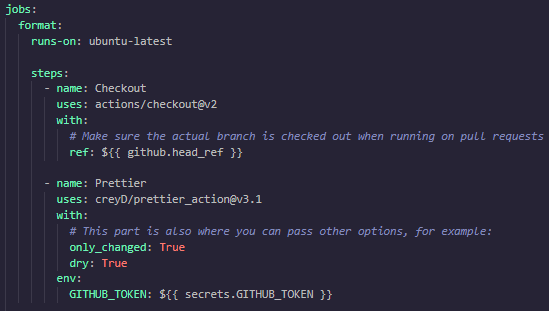

    - only_changed: True - Csak a megváltozott fájlokra fusson le az ellenőrzés.
    - dry: True - Nem javítja ki a formázási hibákat, csak fail-el az action, ha rosszul formázott fájlt talál.

Létrehoztunk egy .prettierignore file-t is, mert nem akartuk, hogy a dokumentációnkra és a minified js-re is lefusson az ellenőrzés. Ennek érdekében megjelöltük ezt a két fájltípust a prittierignore-ban:

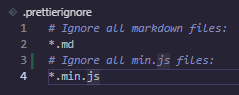

Végül a .prettierrc fájlban megfogalmaztuk, milyen szabályokat szeretnénk a fájlok formázásánál kikényszeríteni.

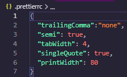

Először a --write kapcsolóval konfiguráltuk be, az only_changed és a dry kapcsolók használata nélkül (ezek default értéke False), így minden fájlt átformázott a Prettier. Így láthattuk, hogyan működik, de végül úgy döntöttünk, hogy ezen a branch-en nem dolgozunk tovább (tech/analysis), hogy ne okozzon fennakadást a sok merge conflict, a megfelelő beállításokkel egy új branch-on (prettier) újból elvégeztük a konfigurációt.

A sikeres automatizált formázás a GitHub Actions felületén:

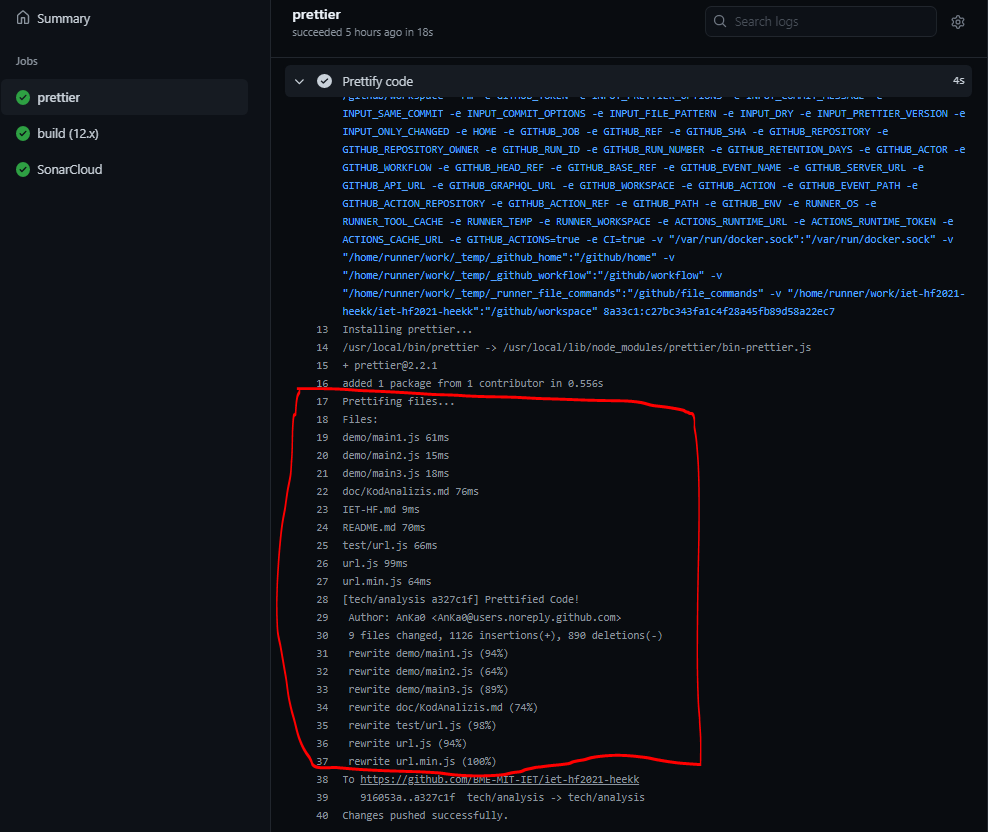

A módosított fájloknál commit message-ben jelzi a Prettier, hogy megjavította a kód formázását ("Prettified Code!"):

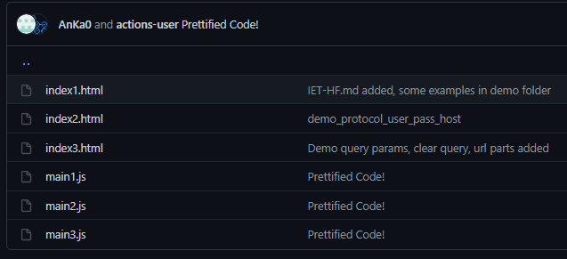

Miután átkonfiguráltuk, hogy ne módosítsa a fájlokat, csak jelezze a rosszul formázott fájlokat, a GitHub Actions felületén így néz ki egy futás, amely rosszul formázott fájlokat talál:

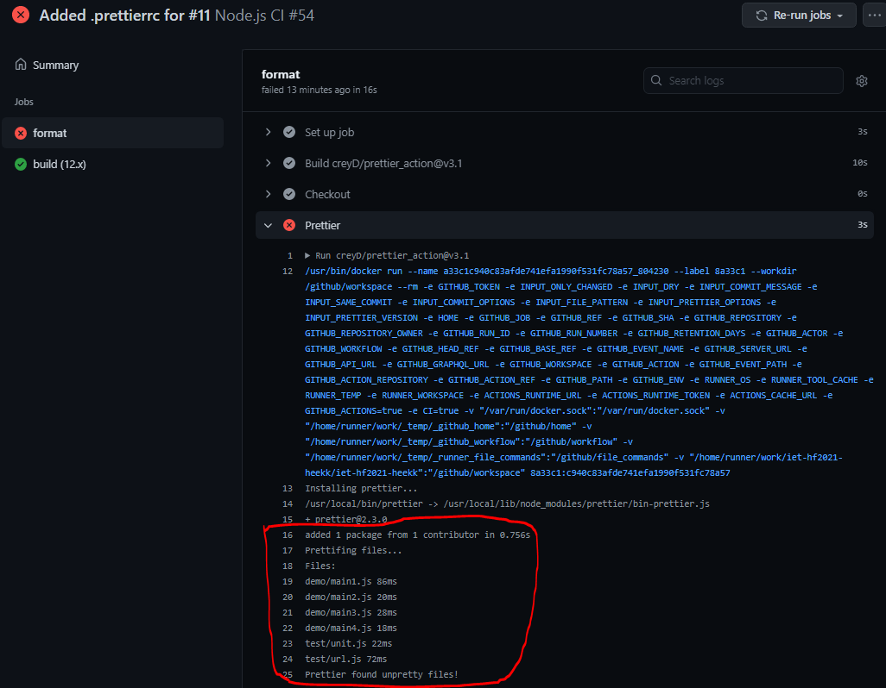

## Manuális kód átvizsgálás

Ennek a feladatnak az elvégzéséhez készítettünk egy strukturált ellenőrző listát.

- Kód olvashatósága, karbantarthatósága

  - Readability:

    - **Code should be self-explanatory. Get a feel of story reading, while going through the code - Am I able to understand the code easily?**

      Nem túl könnyen emészthető a kód, véleményem szerint lehetne javítani az olvashatóságon.

    - **Use appropriate name for variables, functions and classes.**

      Nem mindig használ kifejező változóneveket, sok az 1-2 betűs változónév.

    Például az alábbi kód kommentek, bármilyen magyarázat és rövid, beszélő változónevek hiányában nehezen érthető:

    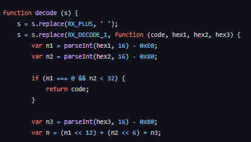
    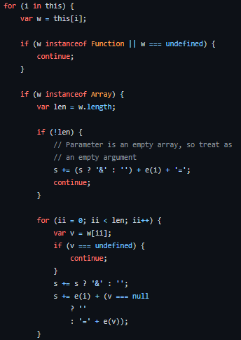

  - Testability:

    - **The code should be easy to test. - Can I unit test / debug the code easily to find the root cause?**

      A tesztelést végző csapattagok szerint nehéz volt a kódot tesztelni a fentebb is említett okok (magyarázat hiánya, nem kifejező változónevek).

    - **Refactor into a separate function (if required)**

      Vannak elég hosszú függvények, ezeket érdemes lett volna több függvényre felbontani.

    - **Try to avoid static functions**

      Nincsenek static függvények a kódban.

  - Debuggability:

    - **Provide support to log the flow of control, parameter data and exception details to find the root cause easily.**

      A kód nem log-ol semmit, nincs jele annak, hogy törekedtek a hibakeresés megkönnyítésére.

  - **Configurability: Keep the configurable values in place (XML file, database table) so that no code changes are required, if the data is changed frequently.**

    A projekt nem használ konfigurációs jellegű adatokat.

  - Coding best practices

    - **No hard coding, use constants/configuration values.**

      A kód tartalmaz beégetett konstansokat (pl. hexadecimális értékek a dekódolást végző függvényben). Például a következő kódrészletben a pirossal aláhúzott konstans érték háromszor is szerepel:

      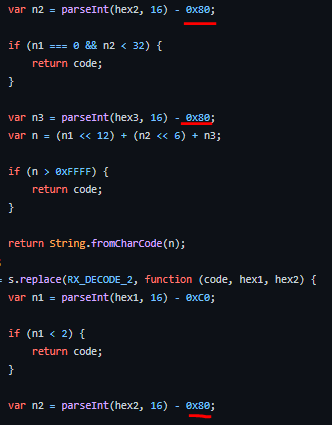

    - **Group similar values under an enumeration (enum).**

      A használt nyelvben nincsenek enumok, nincs olyan része a kódnak, ami megsérti ezt a szabályt, nem fordulnak elő olyan értékek a projektben, ahol érdemes lenne eunomkhoz hasonló struktúrát kialakítani.

    - **Comments – Do not write comments for what you are doing, instead write comments on why you are doing**.

      Kevés komment van a kódban, így az nehezen érthető. Viszont ahol vannak kommentek, azok jól követik a fenti szabályt - azt írják le, miért ezt a megoldást használták. Pl.:

      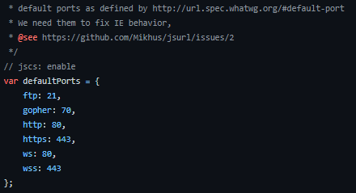
      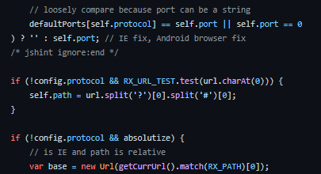

    - **Avoid multiple if/else blocks**

      Nincsenek súlyosan hosszú if/else blokkok (maximum 2 else).

  - **Extensibility – Easy to add enhancements with minimal changes to the existing code. One component should be easily replaceable by a better component.**

    A projektnek nincs sok komponense. A parse-olást, kódolást, dekódolást végző függvények egységbezártak, könnyen cserélhetők.

  - **Usability – Put yourself in the shoes of a end-user and ascertain, if the user interface/API is easy to understand and use.**

    Egyszerű a library használata, nem kell sok időt fordítani a használat mikéntjének megértésére.

- Biztonság, sebezhetőség

  Nem fontos szempont ennél a projektnél.

- Teljesítmény

  - **Reliability – Exception handling and cleanup (dispose) resources.**

    Nincs kivételkezelés a kódban.

  - **Use a data type that best suits the needs such as StringBuilder, generic collection classes.**

    Dinamikusan típusos nyelv lévén ezt nehéz megítélni.

  - **Lazy loading, asynchronous and parallel processing.**

    A projektre nézve nem releváns szempont.

  - **Caching and session/application data.**

    A projektre nézve nem releváns szempont.

- Bevett programozási minták, gyakorlatok

  - **DRY (Do not Repeat Yourself) principle: The same code should not be repeated more than twice. - Is the same code duplicated more than twice?**

    Teljesül.

  - **Is this function or class too big? If yes, is the function or class having too many responsibilities?**

    A projekt lényegében egyetlen fájlból áll, érdemes lenne kisebb részekre bontani, illetve a hosszabb függvényeket is.
