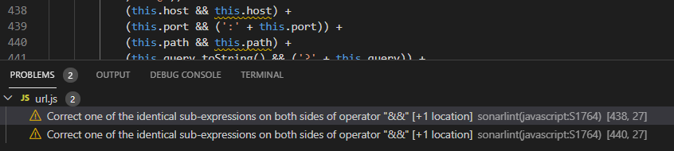
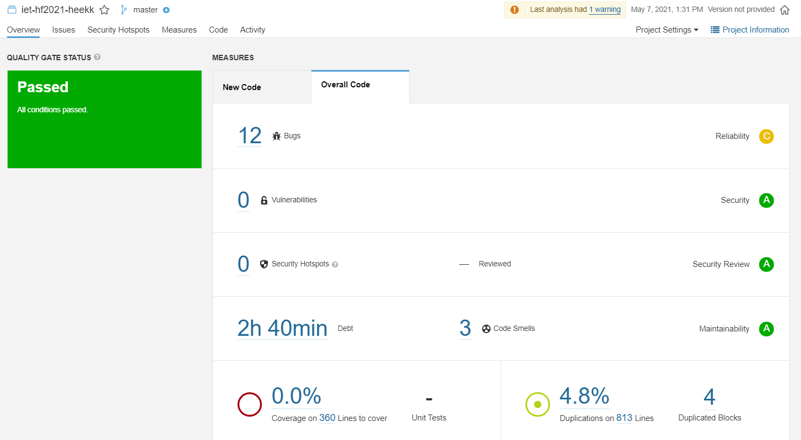
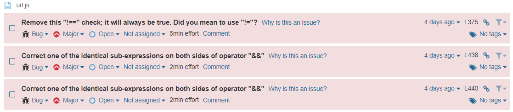
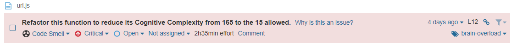
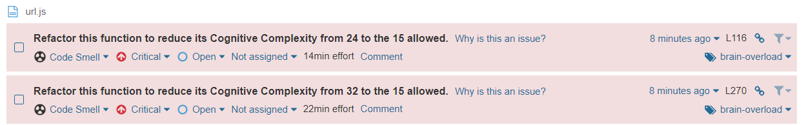
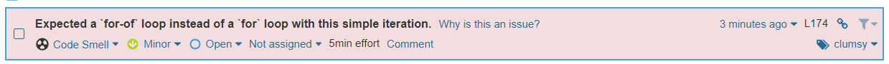
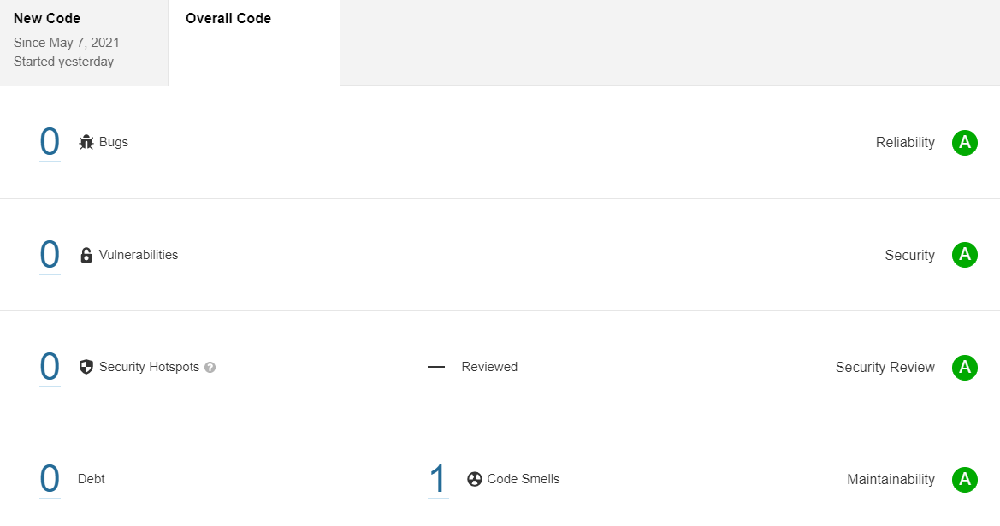

# Statikus analízis

## SonarLint VS Code-ban

Először a gyökérkönyvtárban található url.js-en néztük meg a SonarLint eredményét:


Mindkét jelzett problémával egyetértettünk.

## SonarQube

Ahhoz, hogy lokálisan sikerüljön statikusan megvizsgálni a kódot, ahhoz a SonarQube-ot választottuk. Ehhez először leszedtem a megfelelő docker image-t, beállítottam a megfelelő konfigurációkat, telepítettem a szükséges dolgokat, majd a localhost:9000-es portján sikerült elindítom. A projekt létrehozása után a lokális könyvtárban kellett futtatni az analízist: 

```bash
sonar-scanner.bat -D"sonar.projectKey=iet-hf2021-heekk" -D"sonar.sources=." -D"sonar.host.url=http://localhost:9000" -D"sonar.login=${TOKEN_KEY}"
```

És meg is jelent az analízis:



A hibák száma azonban ennél valójában kevesebb, mert a feladat megismeréséhez írt demo kódokat is belevette. Később rájöttünk, hogy ezt a `-Dsonar.exclusions=**/demo/**/*˙` opcióval kitudjuk küszöbölni, így már fele annyi bug jelent meg.

A korábban talált bugokat itt is megtalálta, és mellé megjelentek egy új az url.js fájlnál:



Az összes hibával egyetértettem, ezért kijavítottam őket.

És egy code smell is:



A fájlban egy anonim főfüggvény van definiálva és rögtön meg is hívva. Ezt átalakítottam, de ezután is jelzett code smellt: 



Habár a Code Smell-ek számából több lett, a Technical Debt 2.5 óráról 40 percre csökkent.

Miközben ezeket javítottam folyamatosan jöttek újabb Code Smellek is, viszont ezek már kisebbek, például:



Végül egyetlen TODO komment maradt egy nagyobb issue-ra hivatkozva, a többi hibát mind sikerült kijavítani:




### Manuális kód átvizsgálás

Ennek a feladatnak az elvégzéséhez készítettünk egy strukturált ellenőrző listát.

#### Strukturált ellenőrző lista

-   Kód olvashatósága, karbantarthatósága

    -   Readability:

        -   Code should be self-explanatory. Get a feel of story reading, while going through the code. - Am I able to understand the code easily?
        -   Use appropriate name for variables, functions and classes.

    -   Testability:

        -   The code should be easy to test. - Can I unit test / debug the code easily to find the root cause?
        -   Refactor into a separate function (if required).
        -   Use interfaces while talking to other layers, as interfaces can be mocked easily
        -   Try to avoid
            -   static functions,
            -   singleton classes as these are not easily testable by mocks.

    -   Debuggability:

        -   Provide support to log
            -   the flow of control,
            -   parameter data
            -   and exception details to find the root cause easily.
            -   If you are using Log4Net like component then add support for database logging also, as querying the log table is easy.

    -   Configurability: Keep the configurable values in place (XML file, database table) so that no code changes are required, if the data is changed frequently.

    -   Coding best practices

        -   No hard coding, use constants/configuration values.
        -   Group similar values under an enumeration (enum).
        -   Comments – Do not write comments for what you are doing, instead write comments on why you are doing. Specify about any hacks, workaround and temporary fixes. Additionally, mention pending tasks in your to-do comments, which can be tracked easily.
        -   Avoid multiple if/else blocks.

    -   Extensibility – Easy to add enhancements with minimal changes to the existing code. One component should be easily replaceable by a better component.

    -   Usability – Put yourself in the shoes of a end-user and ascertain, if the user interface/API is easy to understand and use.

-   Biztonság, sebezhetőség

    -   Authentication
    -   authorization
    -   input data validation against security threats
        -   such as SQL injections
        -   and Cross Site Scripting (XSS)
    -   encrypting the sensitive data (passwords, credit card information etc.)

-   Teljesítmény

    -   Reliability – Exception handling and cleanup (dispose) resources.
    -   Use a data type that best suits the needs such as StringBuilder, generic collection classes.
    -   Lazy loading, asynchronous and parallel processing.
    -   Caching and session/application data.

-   Bevett programozási minták, gyakorlatok

    -   DRY (Do not Repeat Yourself) principle: The same code should not be repeated more than twice. - Is the same code duplicated more than twice?
    -   Is this function or class too big? If yes, is the function or class having too many responsibilities?
    -   The code should follow the defined architecture.
        -   Separation of Concerns followed
            -   Split into multiple layers and tiers as per requirements (Presentation, Business and Data layers).
            -   Split into respective files (HTML, JavaScript and CSS).
        -   Code is in sync with existing code patterns/technologies.
    -   Object-Oriented Analysis and Design (OOAD) Principles
        -   Single Responsibility Principle (SRS): Do not place more than one responsibility into a single class or function, refactor into separate classes and functions.
        -   Open Closed Principle: While adding new functionality, existing code should not be modified. New functionality should be written in new classes and functions.
        -   Liskov substitutability principle: The child class should not change the behavior (meaning) of the parent class. The child class can be used as a substitute for a base class.
        -   Interface segregation: Do not create lengthy interfaces, instead split them into smaller interfaces based on the functionality. The interface should not contain any dependencies (parameters), which are not required for the expected functionality.
        -   Dependency Injection: Do not hardcode the dependencies, instead inject them.