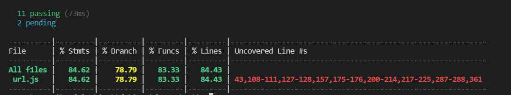
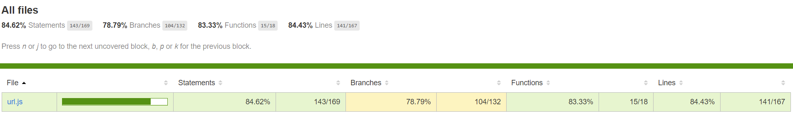
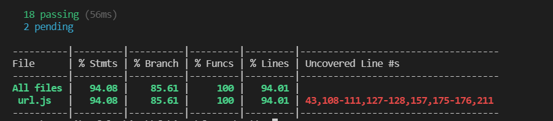
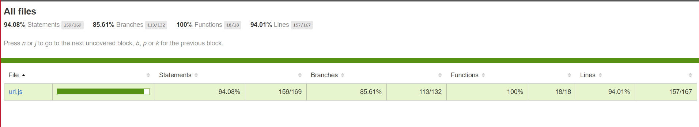

# Unit tesztelés

A meglévő unit teszteket futtatuk,melyek közül egy kivételével sikerellel lefutottak, ezt az egyet javítottuk, ahol egy konstans értékét utólag megakarták változtatni.

A tesztekhez chai assertion library-t használtunk.

A kód lefedettség méréséhez az istanbul package-t telepítettük, majd a package.json-ben létrehoztunk egy scriptet, ami html fájlba is kigenerálja az eredményeket.

### Az eredeti kód lefedettség:

Az új teszteket a unit.js fájl tartalmazza.

Az alábbi részekhez írtunk teszteket:
- Query paraméterek létezésének ellenőrzése
- Query paraméterbe történő tömb átadás
- Speciális karakterek kódolása és dekódolása

### Az új tesztek utáni kód lefedettség:

A 100% lefedettség azért nem érhető el, mert egyes részei a kódnak csak böngészőből futtatva érhetőek el, mi pedig NodeJS-ben teszteltünk.

A kód aluldokumentálságának köszönhetően sok időbe telt megérteni a kódot, így a tesztek megírása is sok időt vett igénybe.

### A tesztek futtatási parancsai:
- régi tesztek: `npm run test-original`
- összes teszt: `npm run test`
- régi lefedettség: `npm run coverage-original`
- új lefedettség: `npm run coverage`
- html report készítés: `npm run report`