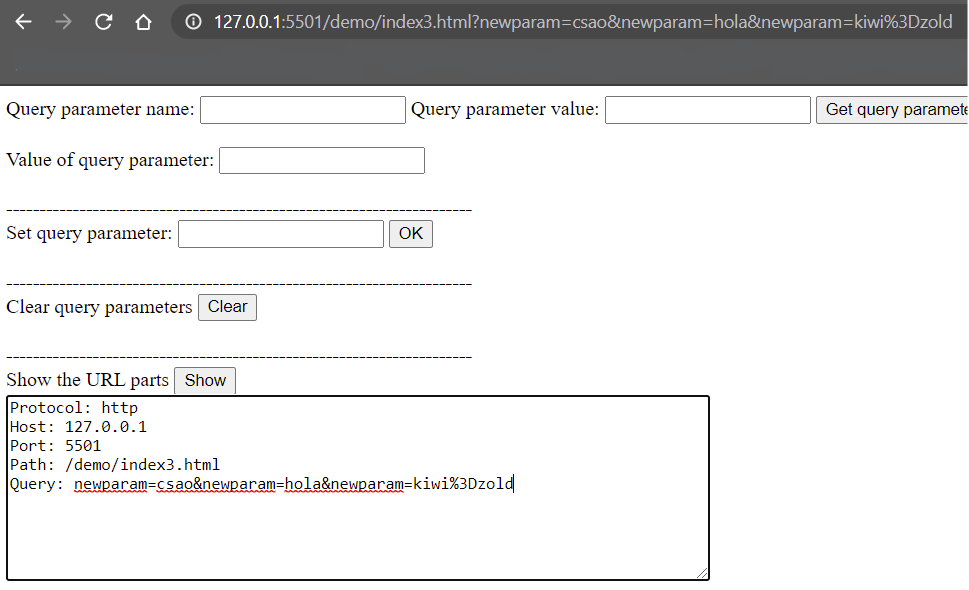
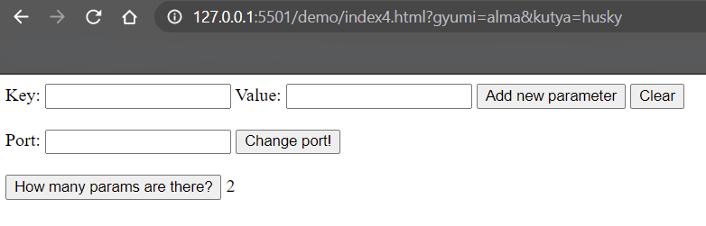

# A könyvtár tesztelése Chrome böngészőben

A böngésző verziója: 90.0.4430.93 (a verzió 2021.04.27-én jött ki)

## Az url.html fájlban lévő tesztek futtatása

Az első eset, ha semmilyen transzformációt nem kívánunk végezni.

Az url megfelelő részeinek lekérdezése pl. host, port.

Abszolút url tesztelése.

Relatív url tesztelése. A szülő könyvtár használatával is, illetve annak a helyes kezelése, ha a gyökér könyvtáron túl mutatna az url.

A query paraméterek törlésének tesztelése.

Kisbetű-nagybetű érzékenység vizsgálata.

Az útvonal enkódolása pl. szóköz helyes használata.
A beadott url: `http://server.com/path with spaces.html`

A tesztek mind sikeresen lefutottak.

## Tesztelés manuálisan

Az útvonal helyes meghatározása.
A query paraméterek hozzáadása.

Útvonal egyszerűsítés tesztelése.

Tömb típusú query paraméter kezelésének ellenőrzése.

Összes paraméter törlése.

A query paraméterek számának, illetve az üresség helyes megállapításának tesztelése.

## A demo mappában lévő tesztek kipróbálása

Index1.html, query paraméter hozzáadása: 

Index3.html, az útvonal elemeinek azonosítása:

Index4.html, a query paraméterek megszámolása:

Minden teszt sikeresen lefutott és az elvárt viselkedést hozta.