# A könyvtár tesztelése Edge böngészőben

A böngésző verziója: 90.0.818.56 (Hivatalos build) (64 bites)

## Az url.html fájlban lévő tesztek futtatása

### Transzformáció nélküli teszt

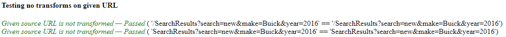

### Full URL teszt

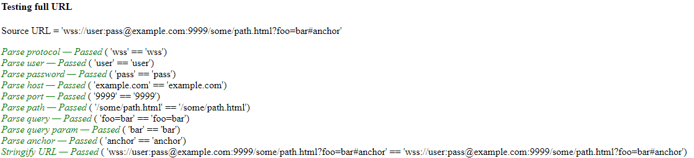

### Relative-absolute URL teszt

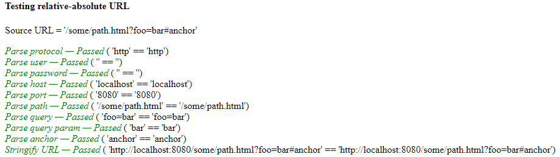

### Relative URL teszt

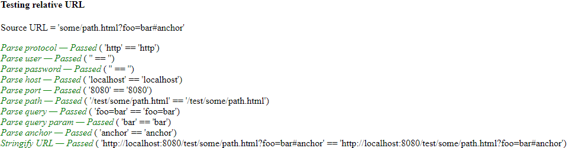

### Relative URL teszt - szülő könyvtárba lépés

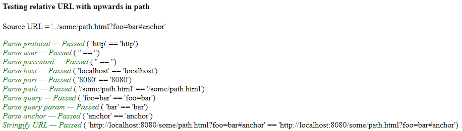

### Relative URL teszt - root könyvtárnál feljebb lépés

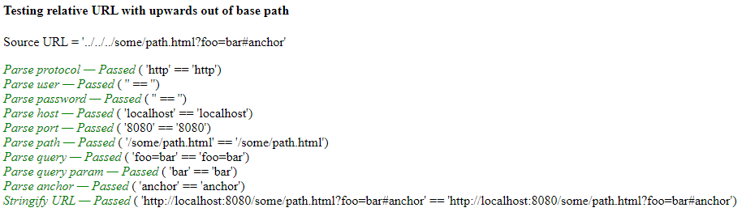

### Query paraméter eltüntetés teszt

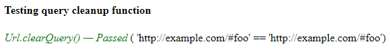

### Case sensitivity, enkódolás - dekódolás teszt

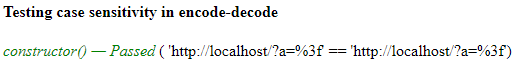

### Enkódolás teszt

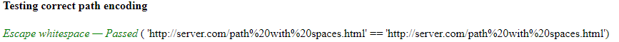

### Tesztek megismétlése egy iframe-en belül

A fent felsorolt tesztek egy iframe-en belül is meg lettek ismételve, ugyan ezekkel az eredményekkel

## Tesztelés manuálisan

### Protokol változtatás

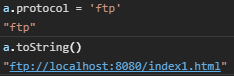

### User és password változtatás

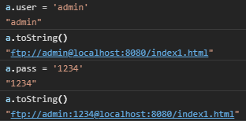

### Host változtatás

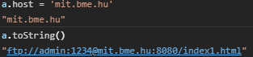

### Port változtatás

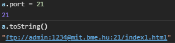

### Path változtatás

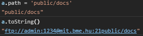

### Query változtatás

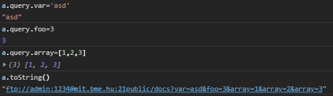

### Hash változtatás

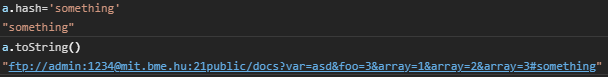

