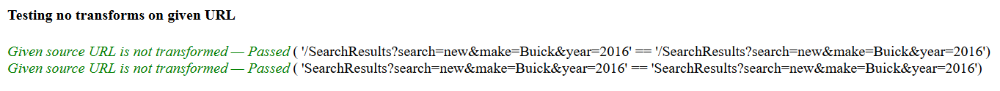
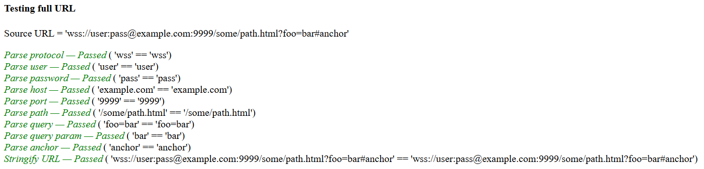
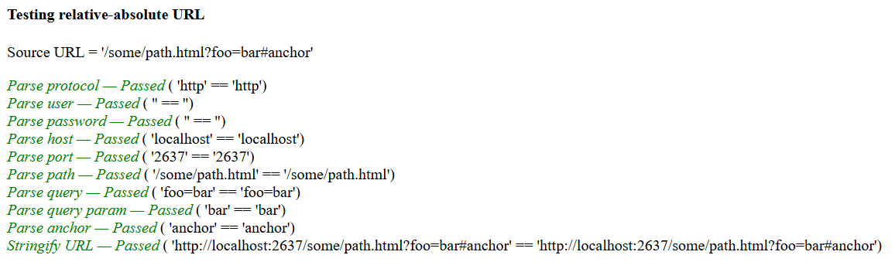
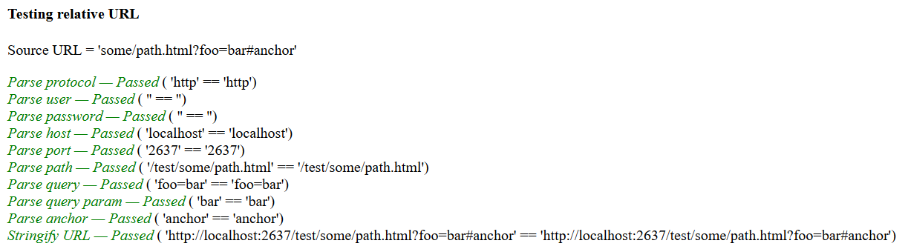
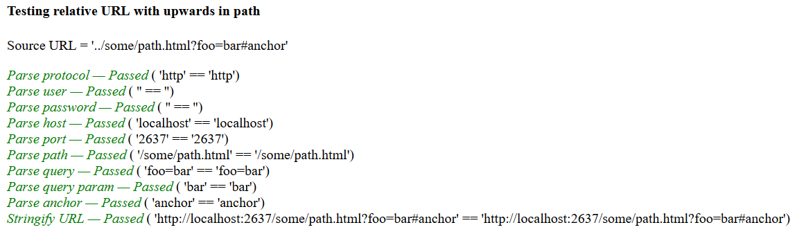
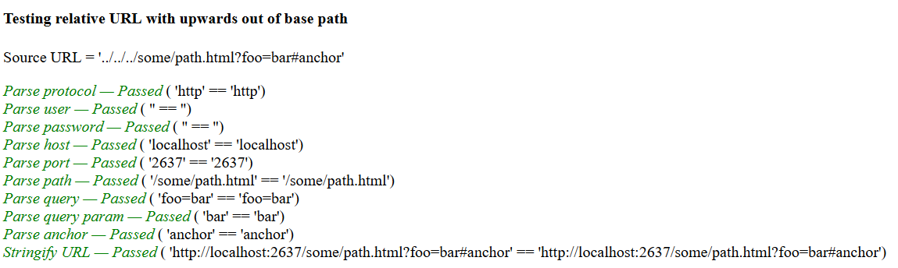
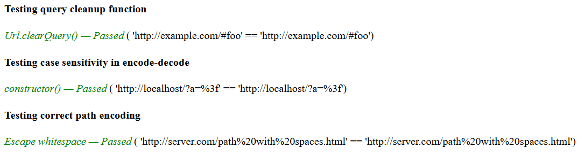
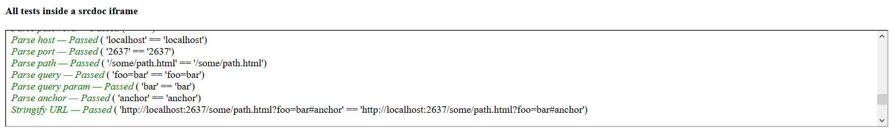
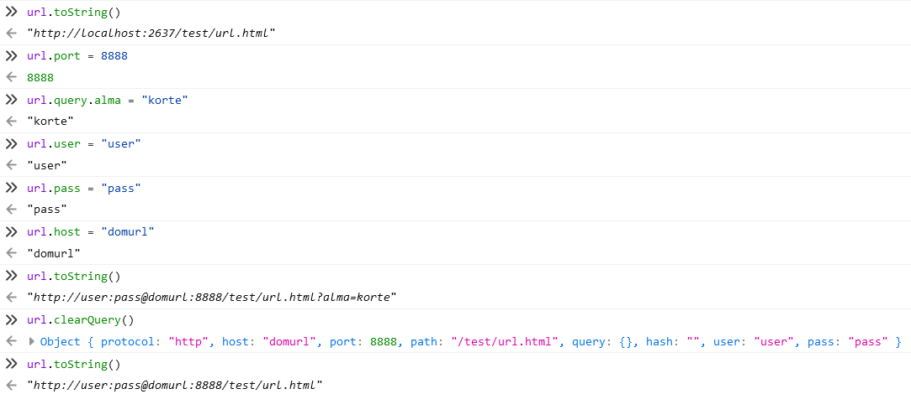

# A könyvtár tesztelése Firefox böngészőben

A böngésző verziója: 88.0.1 (64-bit)

## Az url.html fájlban lévő tesztek futtatása

Transzformáció nélkül teszt:

A teljes url-re és különböző részeire vonatkozó teszt:

Abszolút url tesztelése:

Relatív url tesztelése:

Relatív url tesztelése útvonalban szülő könyvtárba lépéssel:

Relatív url tesztelése gyökérkönyvtáron túl lépéssel:

Paraméterek törlésének, kis és nagy betűk érzékenységének, illetve a helyes enkódolás tesztelése:

Az előbbi tesztek futtatása iframe-en belül is mind sikeresek:

## Tesztelés manuálisan

Különböző tulajdonságok változtatása, paraméterek hozzáadása és törlése is sikeres volt:

