# A könyvtár tesztelése Opera böngészőben

Böngésző verziója: 76.0.4017.123

## Az url.html fájlban lévő tesztek futtatása

Transzformációk nélküli teszt:

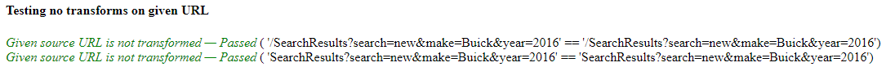

Az URL adott részeinek lekérdezése (protocol, user, password, stb.):

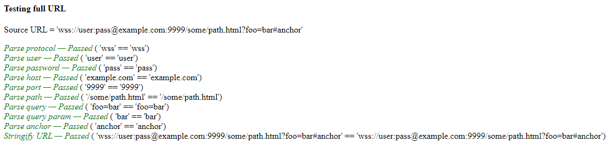

Abszolút URL teszt:

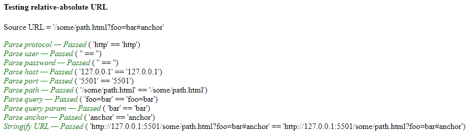

Relatív URL teszt:

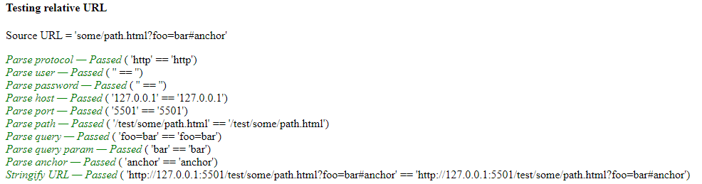

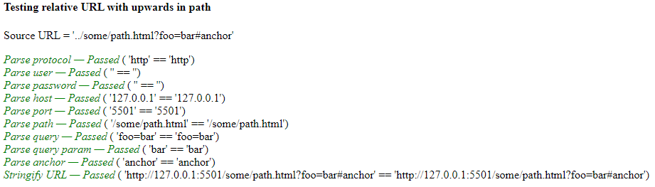

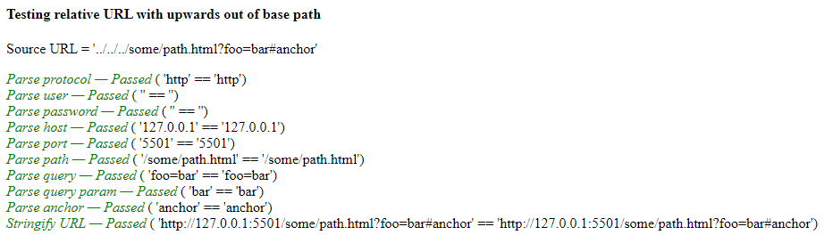

Query paraméterek törlésének tesztje:

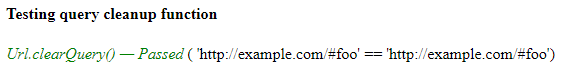

Kisbetű-nagybetű érzékenység teszt:

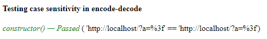

Az útvonal enkódolása:

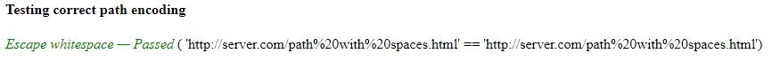

A tesztek sikeresen lefutottak.

## Manuális tesztelés

Az útvonal meghatározása, query paraméterek hozzáadása:

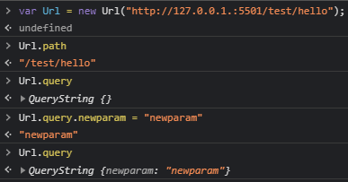

Útvonal egyszerűsítés:

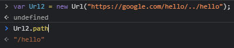

Tömb típusú query paraméter kezelése:

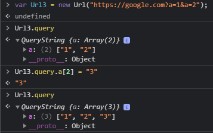

Összes paraméter törlése:

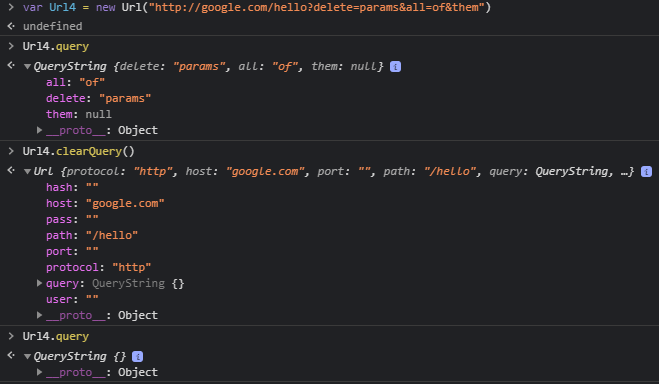

A query paraméterek száma, üres query:

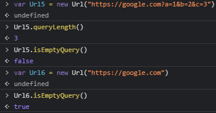

## A demo mappában lévő tesztek

Index1.html, query paraméter hozzáadása a "valami" beállítása után:

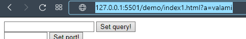

Index3.html, az útvonal elemeinek azonosítása:

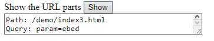

Index4.html, a query paraméterek megszámolása:

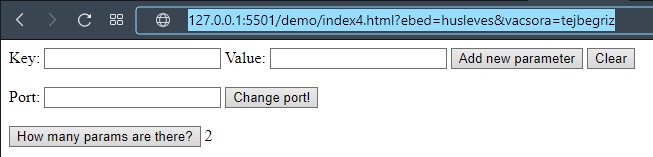
