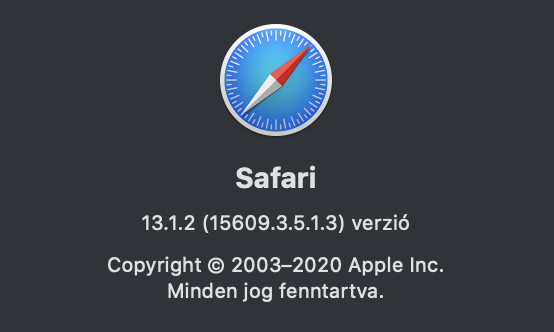
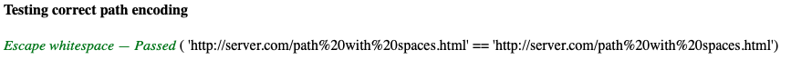

# Tesztelés Safari böngészőben
A teszteléskor használt Safari verziója: 13.1.2 (15609.3.5.1.3)

## Az eredeti tesztek (test/url.html) eredményei:

URL módósítása nélküli teszt:

Egy URL különböző részeinek lekérdezése (pl.: user, port, path, stb):

Abszolút URL teszt: 

Relatív URL tesztek:

Query paraméterek törlése teszt:

Kisbetű-nagybetű érzékenység teszt:

URL-ben található szóközök enkódolásának tesztelése:

Az összes teszt sikeresen lefutott.

## Kézi tesztelés

Query paraméterként két tömb átadása:

Útvonal egyszerűsítése:

Query ürességének, illetve query-hez hozzáfűzés tesztelése:

## Konklúzió
A könyvtár a Safari böngészőben is az elvártak szerint működik.